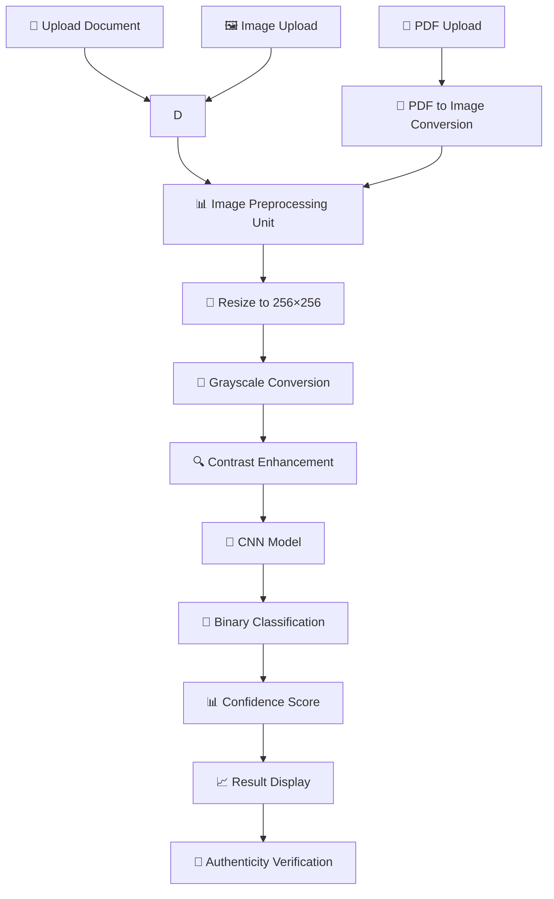

<div align="center">

# 🔍 Document Forgery Detection

# Deep Learning CNN Based Document Authentication System

## Detect Forgery. Verify Authenticity. Ensure Trust. 🛡️

</div>

---

<p align="center">


</p>

---

# 📖 Project Description

The **Document Forgery Detection System** is a deep learning–based application designed to identify whether a document is ORIGINAL or FORGED using image analysis techniques. Built using Convolutional Neural Networks (CNNs), this system focuses on detecting subtle visual inconsistencies that commonly occur in forged documents, such as alterations, manipulations, or low-quality scans.

The application supports image files (JPG, PNG) as well as PDF documents, processes them into a standardized format, and predicts forgery with a confidence score. It runs as an interactive Streamlit web application, making it simple, intuitive, and suitable for real-world use.

---

# ✨ Key Highlights

- 🔍 CNN-Powered Forgery Detection
- 📄 Supports Images (JPG, PNG) & PDF Files
- 📑 Page-Wise Analysis for Multi-Page PDFs
- 🎯 Adjustable Prediction Threshold
- 📊 Confidence Score Visualization
- 🖼️ Original vs Preprocessed Image Comparison
- 📈 Upload History Tracking
- 📥 Downloadable Result Report
- 🎨 Clean & Intuitive UI
- 🧠 Deep Learning Based Authentication

---

# 🏗 System Architecture

The Document Forgery Detection System follows a modular CNN pipeline that transforms uploaded documents into authenticity predictions through preprocessing, feature extraction, and binary classification.



---

### 🔄 Application Workflow

1. User uploads an image (JPG/PNG) or PDF document.
2. For PDFs, each page is converted to an image.
3. Image is converted to grayscale and resized to 256×256.
4. Contrast enhancement is applied for better feature extraction.
5. Image is normalized and passed to the CNN model.
6. Model outputs probability of forgery.
7. Threshold-based classification determines final label (ORIGINAL/FORGED).
8. Results are displayed with confidence score.
9. History and confidence trends are updated.

---

# 📊 Feature Comparison

| Feature | Manual Verification | CNN Detection |
|:---|:---:|:---:|
| Speed | Slow | ✅ Instant |
| Accuracy | Subjective | ✅ High |
| Consistency | Variable | ✅ Consistent |
| PDF Support | ❌ | ✅ |
| Page-Wise Analysis | ❌ | ✅ |
| Confidence Score | ❌ | ✅ |
| Threshold Adjustment | ❌ | ✅ |
| History Tracking | ❌ | ✅ |

---

# ✨ Core Features

## 🔍 Forgery Detection
- CNN-based binary classification
- Original vs Forged prediction
- Probability scoring
- Threshold-based decision

---

## 📄 Multi-Format Support

| Format | Support |
|:---|:---:|
| JPG | ✅ |
| PNG | ✅ |
| PDF | ✅ (Page-wise) |

---

## 📑 Page-Wise PDF Analysis
- Converts PDF pages to images
- Analyzes each page independently
- Page-level forgery detection
- Comprehensive document analysis

---

## 🎯 Adjustable Threshold
- Customizable decision threshold
- Sensitivity adjustment
- Precision/Recall trade-off
- User-controlled classification

---

## 🖼️ Image Preprocessing

| Step | Function |
|:---|:---|
| Grayscale Conversion | Reduces complexity |
| Resize to 256×256 | Standardizes input |
| Contrast Enhancement | Improves feature visibility |
| Normalization | Prepares for model input |

---

## 📊 Result Visualization
- Prediction label display
- Confidence percentage
- Raw probability value
- Original vs preprocessed image comparison
- Confidence trend chart

---

## 📈 History Tracking
- Upload history
- Confidence tracking
- Visual trend analysis
- Result persistence

---

# 🛠 Technology Stack

| Layer | Technology |
|:---|:---|
| Programming Language | Python 3.11 |
| Deep Learning | TensorFlow + Keras |
| User Interface | Streamlit |
| Image Processing | OpenCV |
| PDF Processing | pdf2image + Poppler |
| Data Processing | NumPy + Pandas |
| Visualization | Matplotlib |
| Document Preview | python-docx |
| Model Format | .keras / .h5 |
| Deployment | Streamlit Cloud / Local |
| Version Control | Git & GitHub |

---

# 📂 Project Structure

```text
DOCUMENT-FORGERY-DETECTION-SYSTEM/
│
├── app.py                              # Main Streamlit Application
├── requirements.txt                    # Dependencies
├── README.md                           # Documentation
├── .gitignore                          # Git Ignore
├── code.txt                            # Code Snippets
│
├── src/
│   ├── __init__.py
│   ├── ela.py                          # Error Level Analysis
│   └── preprocessing.py                # Image Preprocessing
│
├── data/
│   ├── forged/                         # Forged Document Samples
│   └── original/                       # Original Document Samples
│
├── runtime/                            # Runtime Files
│
├── forgery_detector.h5                 # Trained Model (H5)
├── forgery_detector.keras              # Trained Model (Keras)
│
└── 02_preview_dataset.ipynb            # Dataset Preview Notebook
```

---

# 📸 Application Preview


The screenshots above demonstrate the Document Forgery Detection System's complete workflow—from document upload and preprocessing to CNN-based forgery detection, confidence scoring, and result visualization.

---


# ⚙ Installation

## Prerequisites

- Python 3.11+
- pip
- Poppler (for PDF processing)

---

### Install Poppler

**Windows:**
```bash
# Download from: https://github.com/oschwartz10612/poppler-windows/releases/
# Add to PATH
```

**macOS:**
```bash
brew install poppler
```

**Linux:**
```bash
sudo apt-get install poppler-utils
```

---

### Clone Repository

```bash
git clone https://github.com/Keya3639/DOCUMENT-FORGERY-DETECTION-SYSTEM.git

cd DOCUMENT-FORGERY-DETECTION-SYSTEM
```

---

### Install Dependencies

```bash
pip install -r requirements.txt
```

---

### Run Application

```bash
streamlit run app.py
```

---

### Alternative Execution

```bash
python app.py
```

---

# 🚀 Demo Workflow

| Step | Action |
|:--:|:---|
| 1 | Upload Image (JPG/PNG) or PDF |
| 2 | Document is Preprocessed |
| 3 | CNN Model Analyzes Document |
| 4 | View Prediction (Original/Forged) |
| 5 | Check Confidence Score |
| 6 | Adjust Threshold (Optional) |
| 7 | View Preprocessed Image |
| 8 | Download Result Report |

---

# 🌟 Why Document Forgery Detection?

Unlike manual verification methods, the **Document Forgery Detection System** leverages **Convolutional Neural Networks** to identify subtle visual inconsistencies and manipulations that are invisible to the naked eye.

This system helps:

- 🔍 Detect forged and manipulated documents
- 🛡️ Verify document authenticity
- 📄 Support PDF and image formats
- 🎯 Provide confidence-based decisions
- 📊 Enable transparent results with visual comparisons

**Document Forgery Detection doesn't just scan documents—it authenticates them.**

---

# 📈 Advantages

- ✅ Detects forgery based on learned visual patterns
- ✅ Works on scanned and photographed documents
- ✅ Page-level detection for PDFs
- ✅ No manual feature extraction required
- ✅ Easy-to-use web interface
- ✅ Can be extended with new document datasets
- ✅ Suitable for academic and real-world demonstrations

---

# ⚠️ Limitations

- Performance depends on training data quality
- Works best on document images, not plain text files
- Cannot explain exact forgery location
- May misclassify very low-quality scans
- Threshold tuning may be required for different datasets
- Not a legal verification tool—acts as a decision support system

---

# 🌟 Real-Time Applications

- 🎓 Education: Verify academic certificates and mark sheets
- 🏦 Banking & Finance: Document verification for KYC
- 📝 Recruitment: Resume and certificate authenticity checks
- 🏛️ Government Offices: Identity and record validation
- ⚖️ Legal Domain: Preliminary screening of submitted documents
- 🏢 Corporate Compliance: Internal document verification

---

# 🔮 Future Enhancements

| Phase | Features |
|:---|:---|
| Phase 1 | Highlight forged regions using explainability techniques |
| Phase 2 | Support for DOCX and TXT forgery analysis |
| Phase 3 | Multi-class forgery detection |
| Phase 4 | Integration with OCR for text-image correlation |
| Phase 5 | Model explainability (Grad-CAM or attention maps) |
| Phase 6 | Cloud deployment (AWS/Streamlit Cloud/Hugging Face) |
| Phase 7 | Export results as PDF reports |
| Phase 8 | Authentication-based user access |

---

# 🛣 Roadmap

- ✅ CNN-Based Forgery Detection
- ✅ Image & PDF Support
- ✅ Page-Wise Analysis
- ✅ Confidence Scoring
- ✅ History Tracking
- 🔄 Grad-CAM Visualization
- 🔄 DOCX/TXT Support
- 🔄 Cloud Deployment

---

# 🎯 Conclusion

The **Document Forgery Detection System using CNN** demonstrates how deep learning can be effectively applied to real-world document verification problems. By leveraging CNN-based visual analysis, the system detects forged documents beyond simple rule-based checks.

With further enhancements and larger datasets, this project can evolve into a powerful tool for academic, professional, and organizational document validation.

---

# 👩‍💻 Developer

## Keya Das

**MCA (Artificial Intelligence & Data Science)**

🌐 **GitHub**

https://github.com/Keya3639

📧 **Email**

keyakarunamoydas@gmail.com

---

# 🙏 Acknowledgements

This project was developed using the following open-source technologies and frameworks:

- 🧠 TensorFlow + Keras
- 👁️ OpenCV
- 🎨 Streamlit
- 🐍 Python
- 📊 NumPy + Pandas
- 📈 Matplotlib
- 📄 pdf2image
- 🌍 Open Source Community

---

<div align="center">

# 🔍 Document Forgery Detection

### Detect Forgery. Verify Authenticity. Ensure Trust. 🛡️

<br>

**Built with ❤️ using**

**Python • TensorFlow • Keras • OpenCV • Streamlit • NumPy • Pandas • Matplotlib**

<br>

</div>

